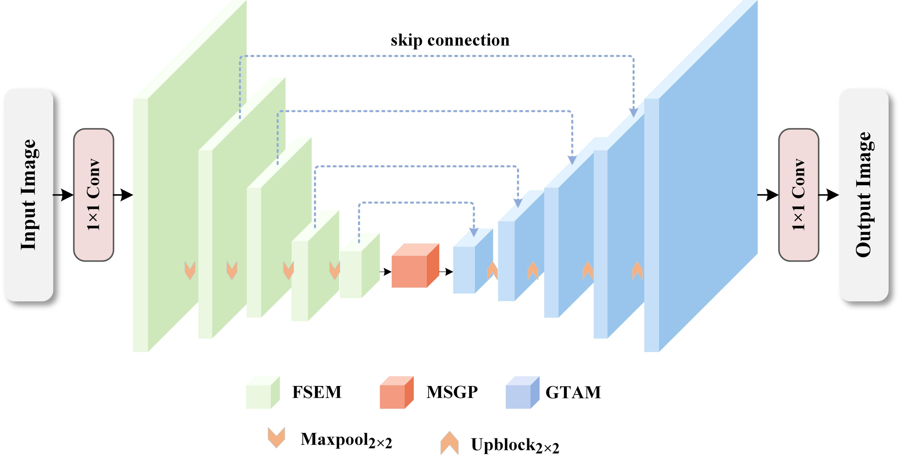
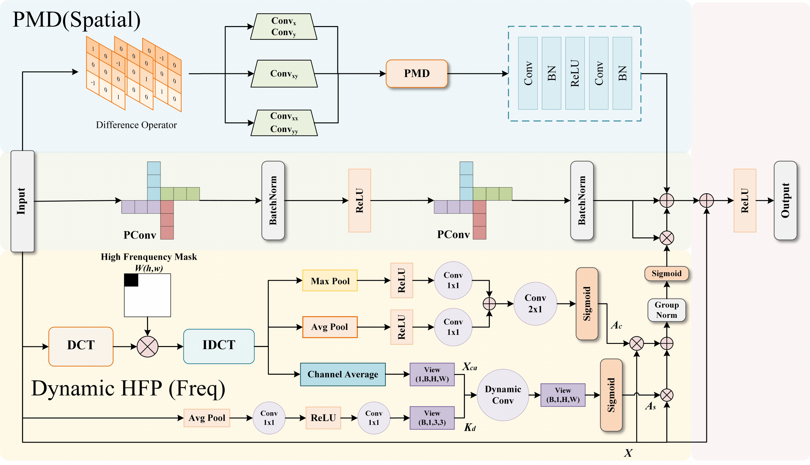
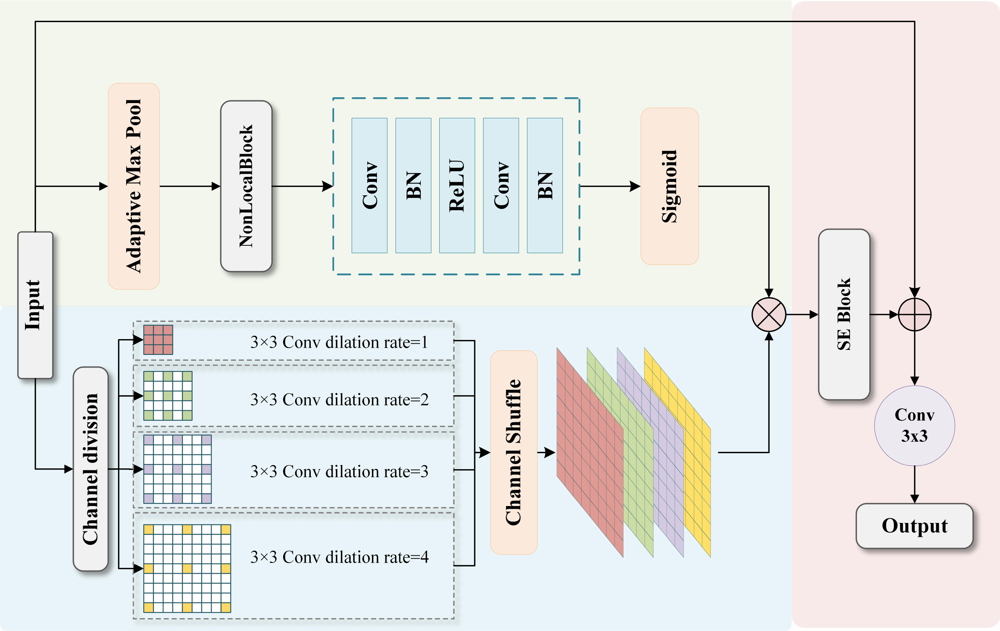
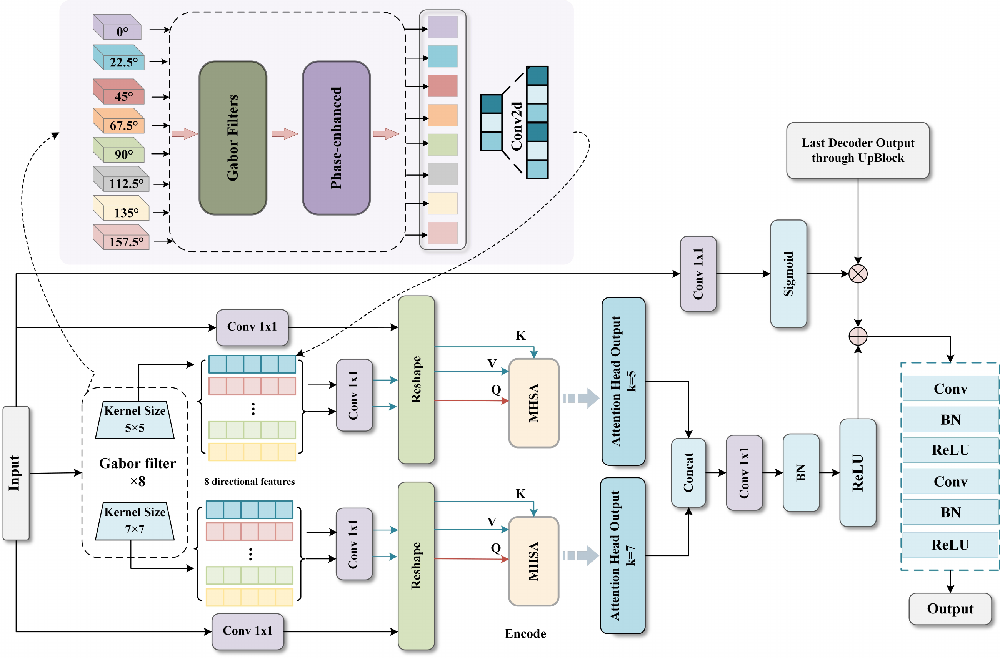
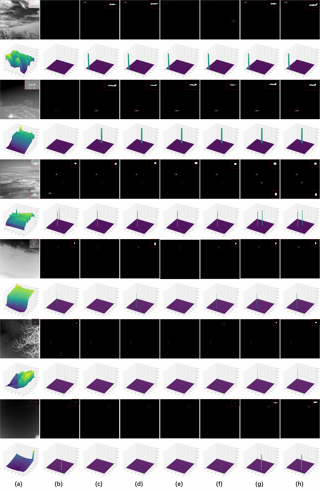

# FSGPNet

### Frequency–Spatial Domain Jointly Guided Perceptual Network for Infrared Small Target Detection


**Joint frequency and spatial perception for detecting dim infrared targets in cluttered scenes.**

[Overview](#overview) · [Architecture](#architecture) · [Quick Start](#quick-start) · [Results](#quantitative-results) · [Citation](#citation)

> This repository contains FSGPNet training/evaluation code and two pretrained checkpoints. Dataset images and masks must be obtained separately. The supplied checkpoints have been evaluated on the included split lists; those measurements differ from the manuscript's tables. Both sets of results are documented below.

## Overview

FSGPNet combines local detail enhancement, global background modeling, and directional feature selection within a U-Net-style encoder–decoder. It is designed for low-contrast infrared small targets against complex background clutter.

**Paper:** *Frequency–Spatial Domain Jointly Guided Perceptual Network for Infrared Small Target Detection*

**Authors:** Yeteng Han, Minrui Ye, Bohan Liu, Jie Li, Chaoxian Jia, Wennan Cui, and Tao Zhang.

The paper title, author list, and manuscript results are transcribed from the supplied corrected manuscript. A verified publication link and final journal metadata are not yet provided in this repository.

## Highlights

- **Frequency–Spatial Feature Enhancement Module (FSEM):** combines pinwheel convolution, Perona–Malik diffusion, and dynamic high-frequency perception using DCT.
- **Multi-Scale Global Perception (MSGP):** combines non-local attention and multi-scale dilated convolution for global contextual modeling.
- **Gabor Transformer Attention Module (GTAM):** aggregates directional Gabor responses at kernel sizes 5 and 7, using eight orientations and attention-based selection.
- **SoftIoU supervision:** optimizes the overlap between sigmoid probabilities and binary target masks.

## Architecture



The encoder uses base channel width 16 and four downsampling operations. FSEM strengthens target features, MSGP processes the bottleneck representation, and GTAM refines skip features before decoder reconstruction. The final output is a one-channel probability map with the same spatial size as the padded input.

| Paper component | Implementation |
| --- | --- |
| FSEM | `Res_block` in `model/FSGPNet/FSGPNet.py`, `APconv.py`, `CDCNs/PMD.py`, `hs_fpn9.py` |
| MSGP | `AGCB_Element` in `model/FSGPNet/context.py` |
| GTAM | `ExpansionContrastModule` and `PhaseEnhancedGaborFilter` in `model/FSGPNet/CDCNs/Gradient_model.py` |
| Output and loss | `net.py`, `loss.py` |

**Parameter accounting:** the manuscript reports 4.75M parameters. The supplied implementation registers 7,246,406 parameters in total, including an unused `mtc` module (2,033,400) and `decoder5` (459,648). Excluding these two modules leaves 4,753,358 registered parameters. They are retained to preserve strict compatibility with the supplied checkpoints. A direct sum over all parameters therefore returns 7.25M.

The following module diagrams are taken from the supplied corrected manuscript.

### FSEM: Frequency–Spatial Feature Enhancement Module

FSEM combines pinwheel convolution, the spatial PMD branch, and DCT-based dynamic high-frequency perception to strengthen target details and suppress background interference.



### MSGP: Multi-Scale Global Perception Module

MSGP combines non-local contextual attention with multi-scale dilated convolution, channel shuffle, and squeeze-and-excitation to refine the bottleneck representation.



### GTAM: Gabor Transformer Attention Module

GTAM extracts Gabor responses at eight orientations and two kernel sizes (5×5 and 7×7), then uses attention and feature fusion to refine skip features for decoder reconstruction.



## Quick Start

### 1. Installation

Clone this repository and open a terminal in the repository root, where `train.py` is located:

```bash
git clone https://github.com/hanyeteng/FSGPNet.git
cd FSGPNet
```

The release checks used **Python 3.10.15, PyTorch 2.0.1, torchvision 0.15.2, and CUDA 11.7**, in the local environment named `irsrgan`. The manuscript describes a different training environment: PyTorch 2.1.2 and an RTX 4090.

To reuse the existing local environment:

```bash
conda activate irsrgan
python -m pip check
```

To create a separate environment with the checked package versions:

```bash
conda create -n fsgpnet python=3.10 -y
conda activate fsgpnet
python -m pip install torch==2.0.1 torchvision==0.15.2 --index-url https://download.pytorch.org/whl/cu117
python -m pip install -r requirements.txt
```

For CPU execution, replace the PyTorch wheel index with `https://download.pytorch.org/whl/cpu`. Choose a compatible PyTorch build for your hardware. CUDA is recommended for full evaluation and training; all entry points also accept `--device cpu`.

### 2. Datasets and Pretrained Weights

The expected directory structure is:

```text
FSGPNet/
├── checkpoints/
│   ├── NUDT-SIRST/FSGPNet.pth.tar
│   └── IRSTD-1K/FSGPNet.pth.tar
├── datasets/
│   ├── NUDT-SIRST/
│   │   ├── images/*.png
│   │   ├── masks/*.png
│   │   └── img_idx/
│   │       ├── train_NUDT-SIRST.txt
│   │       └── test_NUDT-SIRST.txt
│   └── IRSTD-1K/
│       ├── images/*.png
│       ├── masks/*.png
│       └── img_idx/
│           ├── train_IRSTD-1K.txt
│           └── test_IRSTD-1K.txt
├── model/
├── evaluation/
├── utils/
├── train.py
├── test.py
└── test_all.py
```

The two supplied checkpoints are included in the release files. No external checkpoint-download URL has been supplied. Only these two curated weight files are allowed by `.gitignore`; new training outputs are excluded.

Dataset images and masks are excluded from Git. The exact local experiment split lists are included. Each list contains one image identifier per line, **without `.png`**, and images and masks share the same identifier. Masks use 0 for background and 255 for targets. See [dataset instructions](datasets/README.md).

Some supplied IRSTD-1K masks contain intermediate grayscale boundary values (72 training and 13 test masks). The loader converts masks to binary with `raw_mask > 127.5` for both training and evaluation, so every metric uses the same ground truth.

| Dataset | Training images | Test images | Training crop | Normalization mean / std |
| --- | ---: | ---: | --- | --- |
| NUDT-SIRST | 663 | 664 | 256 × 256 | 107.80905151367188 / 33.02274703979492 |
| IRSTD-1K | 800 | 201 | 512 × 512 | 87.4661865234375 / 39.71953201293945 |

**Split note:** the provided IRSTD-1K directory contains 1001 distinct images, whereas the manuscript describes 1000. The included lists preserve all 800 training and 201 test images from the supplied local experiment. They contain no duplicate identifiers and no training/test overlap. Do not silently remove an image when comparing results.

You may keep datasets elsewhere and pass `--dataset_dir` to every script. On the checked Windows machine, for example:

```powershell
python test_all.py --dataset_dir "D:\document\ADGFNet\datasets"
```

### 3. Training

The default protocol uses Adam, learning rate 0.001, cosine annealing to 0.00001, batch size 8, 400 epochs, SoftIoU loss, and prediction threshold 0.5.

```bash
# Train on NUDT-SIRST
python train.py --dataset_names NUDT-SIRST --save ./log

# Train on IRSTD-1K
python train.py --dataset_names IRSTD-1K --save ./log

# Train on both datasets sequentially
python train.py --dataset_names NUDT-SIRST IRSTD-1K --save ./log
```

Training crops use dataset-specific sizes. Augmentation consists of random horizontal/vertical flips and transposition. Evaluation uses full images padded to a multiple of 32 and crops predictions back to their original dimensions.

Checkpoints and logs are saved under `log/DATASET/FSGPNet/`:

- `last.pth.tar`: the most recent epoch, including optimizer, scheduler, scaler, and random states.
- `best.pth.tar`: the highest mIoU among evaluated epochs.
- `N.pth.tar`: checkpoint at each evaluation interval and the final epoch.
- `config.json`, `metrics.json`, `train.txt`: settings and training/evaluation history.

Validation defaults to every 10 epochs and always runs at the final epoch. This script monitors the provided **test split**, consistent with the original code; it does not define a separate validation split. For independent model selection, supply an appropriate validation protocol rather than treating these test measurements as validation performance.

```bash
# Resume a checkpoint produced by this training script, using the same schedule
python train.py --dataset_names NUDT-SIRST --resume ./log/NUDT-SIRST/FSGPNet/last.pth.tar

# Initialize from a trusted supplied checkpoint for further training
python train.py --dataset_names IRSTD-1K --pretrained ./checkpoints/IRSTD-1K/FSGPNet.pth.tar
```

Use `--threads N` to configure data loading; the default is 0 for Windows compatibility. `--device auto` selects CUDA when available. The complete options are shown by `python train.py --help`. Legacy checkpoints without optimizer/scheduler state cannot provide an exact training resume.

`--amp` is retained for CLI compatibility but currently emits a warning and falls back to FP32: the original FP16 DCT/Gabor path produced non-finite loss in the checked environment. Resume with the same optimizer and scheduler settings, including total epochs. Restored random states do not guarantee bitwise-identical CUDA calculations.

### 4. Evaluation

**Evaluate both supplied checkpoints with one command:**

```bash
python test_all.py
```

The script pairs each dataset with its corresponding checkpoint and prints mIoU, nIoU, F1, Pd, and Fa. A timestamped summary is saved under `log/`.

```bash
# Evaluate one checkpoint
python test.py --dataset_names NUDT-SIRST --weight_path ./checkpoints/NUDT-SIRST/FSGPNet.pth.tar
python test.py --dataset_names IRSTD-1K --weight_path ./checkpoints/IRSTD-1K/FSGPNet.pth.tar

# Customize the data root, device, threshold, and output directory
python test_all.py --dataset_dir ./datasets --checkpoint_dir ./checkpoints --device cuda --threshold 0.5 --save_log ./log
```

Full-image evaluation requires batch size 1, including for images with different dimensions. The same absolute probability threshold is applied to all metrics. Pd matches target/predicted connected components by centroid distance < 3 pixels; Fa counts pixels in unmatched predicted components. IoU, nIoU, F1, and Pd are printed as fractions, while printed Fa is scaled by 10⁶.

Only load checkpoints from trusted sources.

### 5. Regression Checks

```bash
python -m unittest discover -s tests -v
```

The checks cover strict checkpoint loading, CPU inference, threshold consistency, zero-mask handling, and false alarms from distinct connected components with equal area.

## Quantitative Results

### Manuscript Results

These values are transcribed from the corrected manuscript. FLOPs and latency refer to the manuscript's measurement environment, not this local release check. Fa is reported in units of 10⁻⁶.

| Dataset | Params (M) | FLOPs (G) | Latency (ms) | IoU (%) | nIoU (%) | F1 (%) | Pd (%) | Fa (10⁻⁶) |
| --- | ---: | ---: | ---: | ---: | ---: | ---: | ---: | ---: |
| NUDT-SIRST | 4.75 | 12.51 | 25.46 | 94.93 | 94.96 | 97.39 | 98.84 | 2.96 |
| IRSTD-1K | 4.75 | 50.02 | 49.74 | 68.14 | 69.08 | 81.07 | 91.58 | 9.68 |

### Supplied Checkpoint Evaluation

Measured on **8 October 2026**, using the supplied weights, the included 663/664 and 800/201 splits, PyTorch 2.0.1 / CUDA 11.7, an RTX 3090, FP32 inference, batch size 1, and threshold 0.5:

| Dataset | IoU (%) | nIoU (%) | F1 (%) | Pd (%) | Fa (10⁻⁶) |
| --- | ---: | ---: | ---: | ---: | ---: |
| NUDT-SIRST | 95.96 | 95.95 | 97.94 | 99.26 | 1.4248 |
| IRSTD-1K | 68.44 | 68.74 | 81.26 | 90.91 | 6.0921 |

These are separate measurements. The supplied checkpoints/splits are **not confirmed to reproduce the manuscript tables exactly**. The released evaluator corrects per-image max normalization in F1 and equal-area component matching in Fa, and uses consistent binary ground truth for antialiased masks. The model predictions are unchanged; label binarization can affect all metrics on the affected IRSTD-1K samples.

## Qualitative Results



Figure from the supplied manuscript. Columns: (a) input, (b) ACM, (c) ISTDU-Net, (d) DNANet, (e) UIUNet, (f) AGPCNet, (g) FSGPNet, (h) ground truth. These comparisons are manuscript figures, not regenerated results from this release check.

## Checkpoint Integrity

| Checkpoint | Size (bytes) | SHA-256 |
| --- | ---: | --- |
| `checkpoints/NUDT-SIRST/FSGPNet.pth.tar` | 29400859 | `b52cce1c54ce4ca14de8960ab9c03d46b4ca1e2ef707afdedf454aa7980015fc` |
| `checkpoints/IRSTD-1K/FSGPNet.pth.tar` | 29387611 | `bf4cf3cf61d22a5d7018033fa4d0a8f6c108495ae60dead92e94d53815779a5c` |

## Acknowledgements

The source includes utilities associated with the BasicIRSTD benchmark and SCTransNet configuration/model definitions. Original author attribution has been preserved. The manuscript also discusses pinwheel convolution, high-frequency perception, and context modeling; please consult its bibliography for the research sources. Third-party code licenses and reuse notices must be checked before selecting a repository-wide license.

The README structure was inspired by [ADGFNet](https://github.com/kuaileBenbi/ADGFNet/blob/main/README.md).

## Citation

Use the following provisional record when referring to the supplied manuscript. Replace it with the publisher's official BibTeX when the publication URL, DOI, volume, and article number have been verified.

```bibtex
@misc{han2026fsgpnet,
  title  = {Frequency--Spatial Domain Jointly Guided Perceptual Network for Infrared Small Target Detection},
  author = {Han, Yeteng and Ye, Minrui and Liu, Bohan and Li, Jie and Jia, Chaoxian and Cui, Wennan and Zhang, Tao},
  year   = {2026},
  note   = {Corrected manuscript; final publication metadata pending verification}
}
```

## License

A repository-wide license has not yet been specified. No MIT or other license is asserted here. Confirm the intended license and relevant third-party terms before publishing the repository as an openly licensed project.
